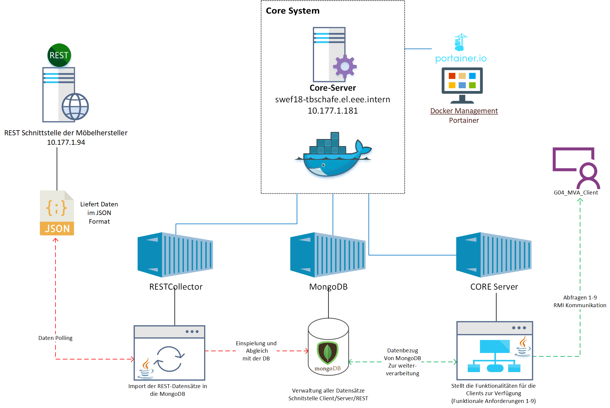

# Moebel Verkauf Analyser (MVA) - SWE Projekt FS18 - Gruppe 04

Implementation der Gruppe G04 fuer SWE-18FS.
Sämtliche Implementationen sind im Unter-Modul "mva-common" gemacht. Das ist etwas unschön aber aus Zeitgründen haben wir das nicht mehr getrennt.

### Architektur
**Architektur Design:**

### How to Start the Servers
Es werden 2 Java-Docker Container und 1 MongoDB Container für die Inbetriebnahme benötigt.

Initialisierung MongoDB Container: https://hub.docker.com/_/mongo/
Initialisierung Java Container: https://hub.docker.com/r/jamesdbloom/docker-java8-maven/

**MongoDB Container**

Es muss eine entsprechende MongoDB eröffnet werden, z.B. über die Mongoshell.

    use DATABASE_NAME

**REST-Collector Container (Java)**

Nachdem Start des Containers müssen folgende Anpassungen vorgenommen werden:

 - Shell in Container aufbauen 
 - `git clone https://github.com/daveschafer/SWE-Project-FS18.git`
  -  login mit GitLab Account 
  - `cd g04-mva` 
  - `cd mva-common`
  -  `mvn clean compile exec:java -Dexec.mainClass=ch.hslu.swe.DataCollector.StartCollector`

**RMIServer Container (Java)**

Nachdem Start des Containers müssen folgende Anpassungen vorgenommen werden:

 - Shell in Container aufbauen 
 - `git clone https://github.com/daveschafer/SWE-Project-FS18.git`
  -  login mit GitLab Account 
  - `cd g04-mva` 
  - `cd mva-common`
  -  `mvn clean compile exec:java -Dexec.mainClass=ch.hslu.swe.server.RMIServerDocker`

### Client

Client Initialisierung: Dafür ist es notwendig ein JAR mit Dependencies zu generieren

https://intellij-support.jetbrains.com/hc/en-us/community/posts/206273809-How-can-I-build-an-executable-JAR-from-a-project-including-neccessary-libraries-

Nachdem man das JAR hat können Befehle wie folgt abgesetzt werden:

       java -cp g04-mva-common-1.0.0-SNAPSHOT-jar-with-dependencies.jar ch.hslu.swe.client.StartClient --help

Oder man macht sich einen Alias und dann muss man nurnoch `Client --help` tippen

Im Ordner "Runnables" liegt ein Ordner mit dem fertigen Client welcher wie folgt gestartet werden kann:

       java -jar Client.jar --help

### Dokumentation

Die Dokumentation findet Ihr im Folder 'Dokumentation'.

### Buildstatus
* 

> Hinweis: Buildstatus ist nur innerhalb HSLU-Netz (oder per VPN) sichtbar!